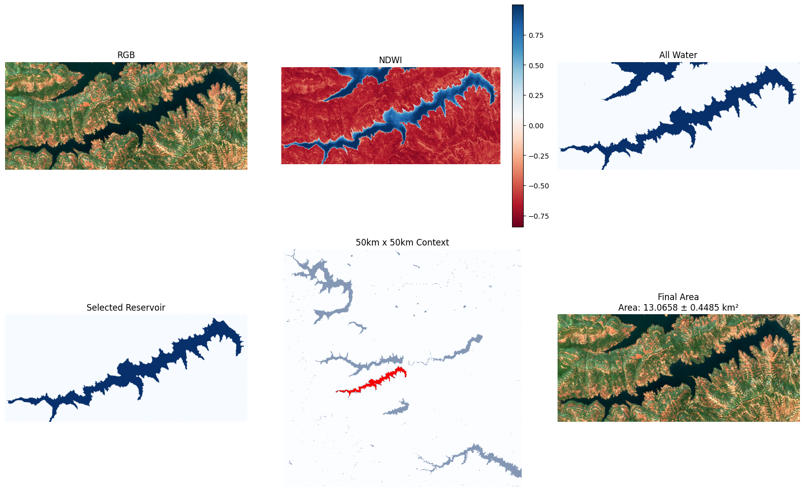
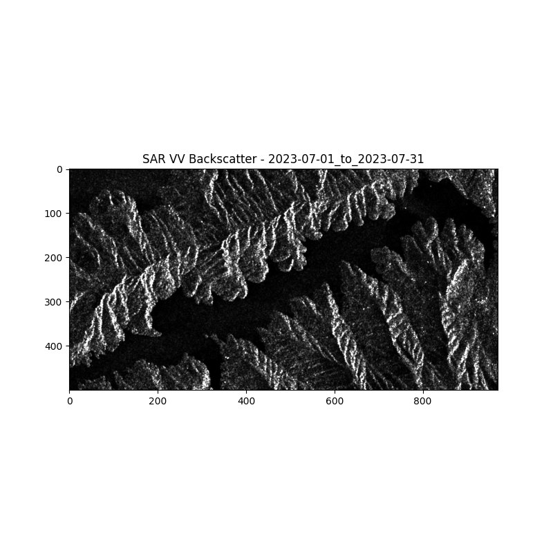
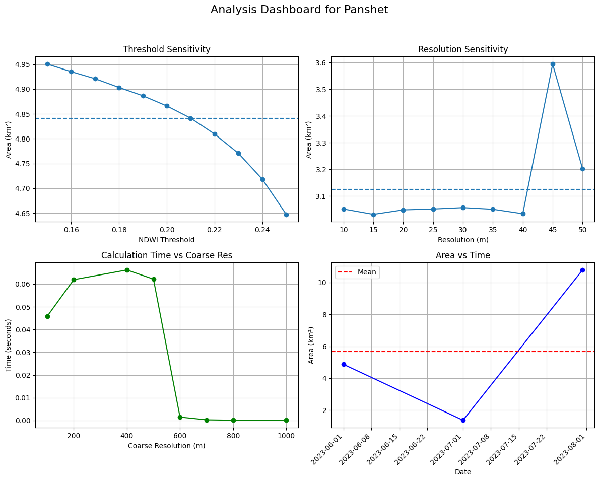

# damArea v2.0

Geospatial measurement pipeline for reservoir perimeter, surface area, and timescale tracking using Sentinel-2 satellite imagery.

## Overview

This project provides an automated pipeline to estimate:
- Reservoir surface area
- Area tracking over time (Timeseries analysis)
- Uncertainty quantification (Resolution & Threshold sensitivity)

The system performs:
- Automatic CRS (UTM) handling and coordinate transformations
- NDWI-based water detection with automated cloud masking
- Connected reservoir selection ensuring we analyze the water body physically attached to the queried dam
- Adaptive bounding box expansion and resolution clamping (adhering to Sentinel-Hub API limits)
- Error margin estimations based on spatial and index resolutions
- Autonomous Cloud-Failovers (Radar + VV Thresholding)

## Architecture

The project utilizes a robust, modular pipeline:
- `fetch_dam/`: Geocoding dams (OpenStreetMap fallback) and loading known dam structural coordinates.
- `pipeline/`: Core steps for raw data acquisition, NDWI processing, parsing pixel areas, and plotting visualizations.
- `sentinel/`: Handlers for the Sentinel-Hub API requests, caching, and arrays.
- `tiling/` & `geometry/`: Geographic spatial manipulations and segment intersections.
- `processing/` & `uncertainty/`: Water mask processing sequences, algorithms to capture the largest connected geometries, and sensitivity models to provide standard errors on computed areas.

## Installation

### Prerequisites
- Python 3.8 or higher
- A Sentinel Hub account with API access

### Steps

1. Clone the repository:
   ```bash
   git clone https://github.com/rushatdixit/damArea.git
   cd damArea
   ```

2. Install dependencies:
   ```bash
   pip install -r requirements.txt
   ```

3. Set up environment variables:
   Create a `.env` file in the root directory with your Sentinel Hub credentials:
   ```env
   SH_CLIENT_ID=your_client_id
   SH_CLIENT_SECRET=your_client_secret
   SH_INSTANCE_ID=your_instance_id
   ```
   *Obtain these credentials from [Sentinel Hub](https://www.sentinel-hub.com/).*

## Usage

The pipeline is entirely controlled through a robust CLI with several subcommands:

```bash
damArea <subcommand> [options]
```

To use the global `damArea` command efficiently from any terminal session, you map an alias in your shell configuration to automatically handle the Python execution and paths.

### Global Command Setup (Mac/Linux)

Run the following from the root directory of this repository:

```bash
echo "alias damArea=\"PYTHONPATH=\$(pwd) python3 \$(pwd)/main.py\"" >> ~/.zshrc
source ~/.zshrc
```
*(Note: If you use bash instead of zsh, replace `.zshrc` with `.bashrc`)*

Now you can run the pipeline directly:

```bash
damArea <subcommand> "Dam Name" <options>
```

### Core Pipeline (`run`)

To execute the standard end-to-end extraction pipeline, use the `run` command:

```bash
damArea run "Bhakra Nangal" --start-date 2023-01-01 --end-date 2023-12-31
```

#### Pipeline Phase Flags
| Flag | Values | Default | Description |
|------|--------|---------|-------------|
| `--area` | `y`, `n` | `y` | Estimate initial reservoir baseline area |
| `--unc` | `y`, `n` | `y` | Process threshold, resolution, and coarse uncertainty analyses |
| `--time` | `y`, `n` | `y` | Run chronological timeseries analysis |

#### Satellite & Resolution Flags
| Flag | Values | Default | Description |
|------|--------|---------|-------------|
| `--sar` | `y`, `n` | `y` | Enable Sentinel-1 SAR as automatic cloud-failover |
| `--resolution` | integer | `10` | Optical target resolution in meters per pixel |
| `--timeseries-step` | integer | `30` | Interval size in days between timeseries scans |

#### Diagnostic & Logging Flags
| Flag | Values | Default | Description |
|------|--------|---------|-------------|
| `--log-level` | `DEBUG`, `INFO`, `WARNING`, `ERROR` | `INFO` | Filter console output verbosity |
| `--log-file` | file path | None | Output structured JSON logs to a file |
| `--extrema` | `y`, `n` | `n` | Show diagnostic dashboard for global min/max area dates |
| `--debug` | `y`, `n` | `n` | Exports RGB diagnostic images to `debug/` |
| `--verbose` | `y`, `n` | `n` | Exports RGB/NDWI/Masks to `deep_debug/` |

---

## The Debugging Suite

We provide a comprehensive set of non-destructive CLI tools to maintain the pipeline and debug data anomalies without burning Sentinel Hub API Processing Units.

### 1. API Health Check (`doctor`)
Verifies your local `.env` configuration and makes a zero-cost catalog ping to confirm your Sentinel Hub credentials are valid and unexpired before you begin a heavy job.
```bash
damArea doctor
```

### 2. Joblib Cache Manager (`cache`)
The pipeline aggressively caches API downloads locally using `joblib`. When thresholds or logic changes, you may want to inspect or purge this data.
```bash
damArea cache list       # List all cached functions and their sizes
damArea cache size       # Total megabytes consumed on disk
damArea cache purge      # Nuke the entire cache
```

### 3. API Budget Predictor (`dry-run`)
Calculates the spatial dimensions of your reservoir, validates Sentinel Hub's 2500px resolution limits, and predicts exactly how many API calls and Processing Units (PU) your job will consume.
```bash
damArea dry-run "Hoover Dam" --start-date 2023-01-01 --resolution 10
```

### 4. Live Quota Monitoring (`rate-status`)
Sentinel Hub imposes strict rate limits. This tool fetches your current available bucket natively from the API headers.
```bash
damArea rate-status
damArea rate-status --watch  # Live-updating 10s dashboard
```
*(Note: the pipeline worker pool also automatically throttles itself if this remaining limit drops below 20 requests)*

### 5. Configuration Auditor (`config`)
Tired of hunting through `.env`, `constants.py`, and hardcoded files? This prints a unified table of the active pipeline configuration.
```bash
damArea config show
```

### 6. Array & Mask Inspector (`inspect`)
Need to see exactly why the pipeline failed on a specific date? Load any intermediate Numpy `.npy` or `.pkl` cache file to review it visually in the console without re-running API queries.
```bash
damArea inspect bbox "Hoover Dam"                   # See bounding box sizes
damArea inspect mask path/to/array.npy              # Review water pixels
damArea inspect ndwi path/to/array.pkl --threshold 0.3
damArea inspect compare optical.pkl sar.pkl         # Computes Intersection over Union (IoU)
```

### 7. Output Sanity Validation (`validate`)
Post-flight sanity checks on your final `your_outputs/*.csv` timeseries data. Flags impossible physical surface areas, identically duplicated timestamps (cache rot), and massive unphysical variations (cloud leaks).
```bash
damArea validate "Hoover Dam" --strict
```

## Visualizations & Sample Outputs

The pipeline automatically compiles its analyses and generates visualization graphics for each dam processed. They are saved to the `your_outputs/` folder. Below are the primary diagnostic snapshots:

### 1. Optical Pipeline Diagnostics
Visualizes the extraction process from Raw RGB, NDWI bounding, up to final isolated water-body contour capturing.


### 2. Autonomous Cloud Fallovers via Sentinel-1 SAR
Tracks times the Sentinel-1 SAR triggers when optical satellites are blinded by extreme weather, rendering the literal backscatter of physical water matrices.


### 3. Timeseries Uncertainty Dashboard
Plots systematic evaluation charts measuring scale robustness against varying NDWI thresholds and pixel physical scales alongside chronological tracking.


## Mathematical Models

To ensure metric rigor and replicability, the system computes properties via the following mathematical boundaries:

### 1. Normalized Difference Water Index (NDWI)
Water bodies are strictly delineated using NDWI, calculated via the Sentinel-2 Green (B03) and Near-Infrared or NIR (B08) optical bands:

$$ NDWI = \frac{\text{Green} - \text{NIR}}{\text{Green} + \text{NIR}} $$

Pixels observing an $NDWI > \text{threshold}$ (typically tuned around 0.2 - 0.3) are computationally flagged as isolated water representations. 

### 2. Physical Area Integration
Given the UTM geographic projection constraints bounding the coordinates, the active pixel layouts are processed as strictly rectangular arrays. A reservoir's overall surface footprint is an arithmetic integration of water pixels normalized to square kilometers:

$$ \text{Area}_{\text{km}^2} = \frac{\sum (\text{Water Pixels}) \times \text{Resolution}_{\text{meters}}^2}{1,000,000} $$

### 3. Cumulative Uncertainty Extraction
To derive the final operational margin of error, the system isolates the sensitivity margin (or variance trajectory) across dynamic NDWI thresholds ($U_t$) and varying spatial API resolutions ($U_r$). The final combined system error bound ($\pm U_{total}$) is rooted via a sum of squares methodology yielding standard geometric variance estimation:

$$ U_{total} = \sqrt{(U_t)^2 + (U_r)^2} $$

## SAR Architecture and Radar Backscatter Mechanics

**What is SAR (Synthetic Aperture Radar)?**
Sentinel-2 optical satellites cannot pierce heavy cloud cover (e.g., during monsoon seasons), leaving massive timeline data gaps. To overcome this, the pipeline autonomously falls back on **Sentinel-1 SAR** (Synthetic Aperture Radar). SAR emits its own active microwave pulses (C-band) towards the Earth's surface and records the returning echoes (backscatter). Because microwave frequencies operate at much longer wavelengths than visible light, they penetrate clouds, rain, and fog with 100% visibility.

**The Mathematics of SAR Water Extraction:**
Water extraction using SAR operates on the physics of **Specular Reflection**. 
1. When radar pulses hit a flat surface (like a calm reservoir), the energy bounces *away* from the satellite in a V-angle, resulting in effectively zero returning energy (an exceedingly dark pixel or a phenomenally low backscatter coefficient).
2. Conversely, rough terrain (forests, dams, buildings) scatters the pulse in all directions (**Diffuse Scattering**), returning high backscatter to the sensor (resulting in phenomenally bright pixels).

**Our Specific Implementation**:
The pipeline requests the **VV Polarization** (Vertical Send, Vertical Receive) sequence from `.SENTINEL1_IW` (Interferometric Wide Swath) GRD collections. The raw amplitude signal arrays arrive with extreme exponential variance.

1. **Speckle Suppression:** SAR imagery is inherently noisy due to coherent interference (speckle). A 5×5 median filter (`SAR_SPECKLE_KERNEL`) smooths the backscatter before thresholding, preventing the water body from fragmenting into disconnected components.
2. **Backscatter Thresholding:** By evaluating the coefficient histogram empirically, we isolate everything underneath `SAR_THRESHOLD = 0.09`. Any physical pixel reflecting less than this intensity energy is computationally verified as fluid water.
3. **Connectivity Mapping:** The identical connected-components isolation logic applied to optical NDWI works simultaneously against the SAR logic. Our bounding constraint strictly selects the largest single coalesced body connected near the geographical OpenStreetMap anchor ensuring puddles and static noise don't corrupt metric tracking.
