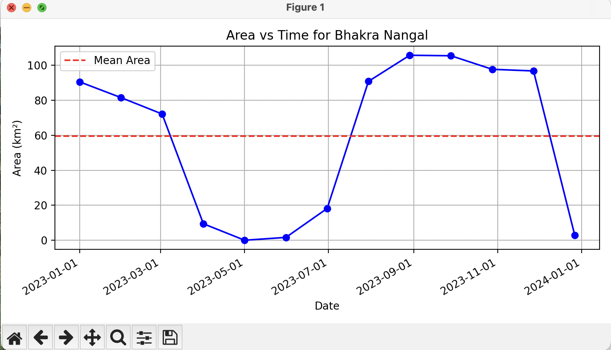
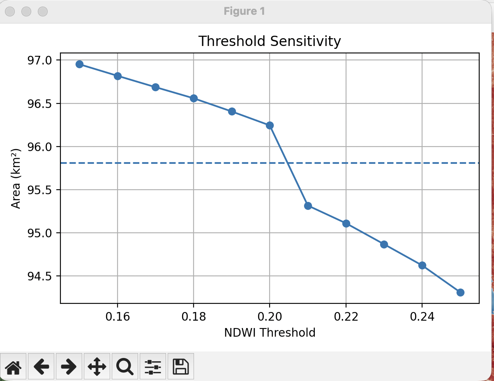
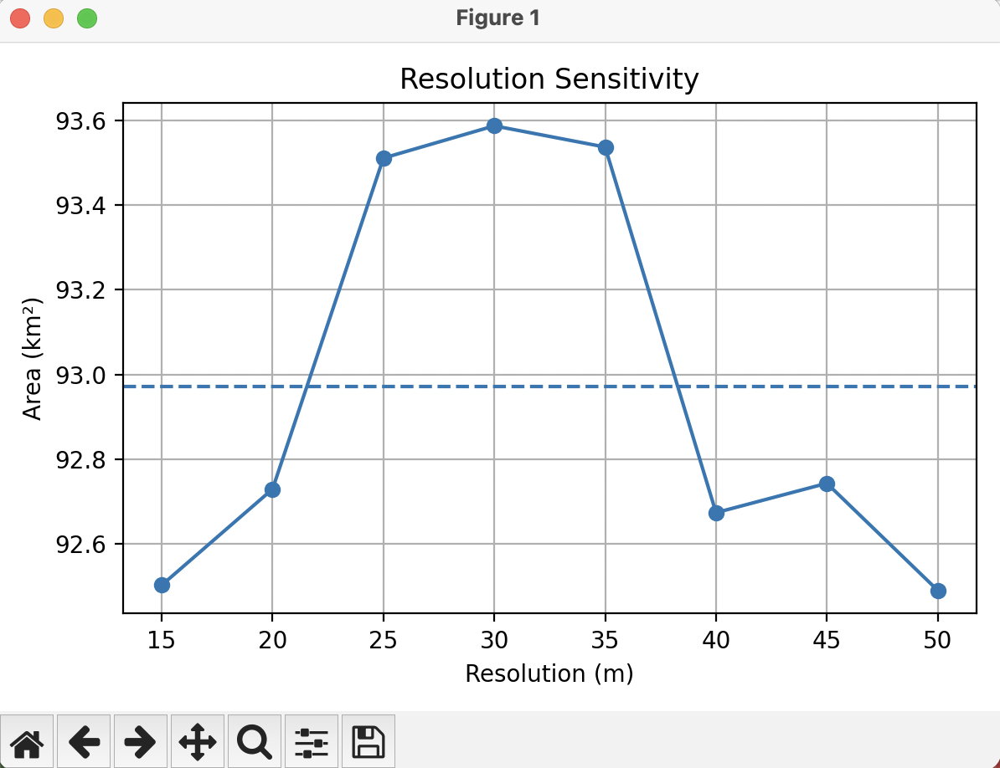
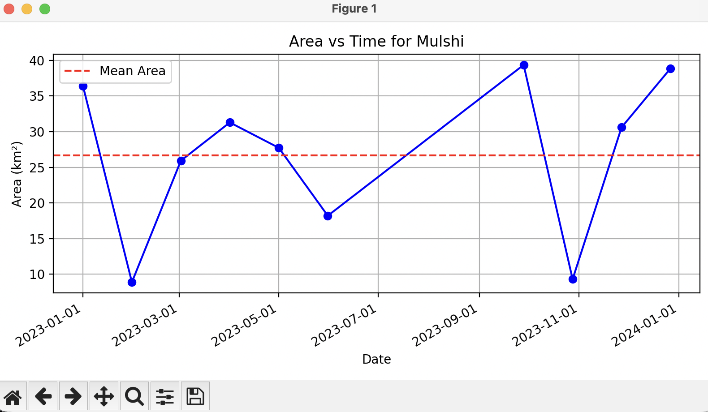
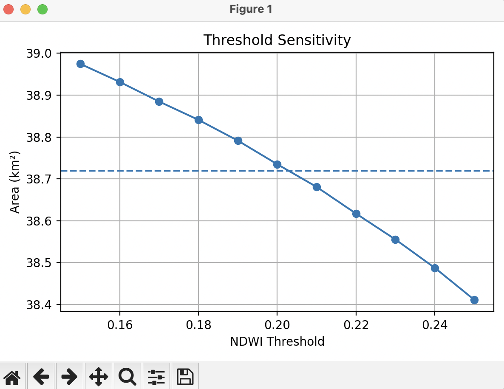
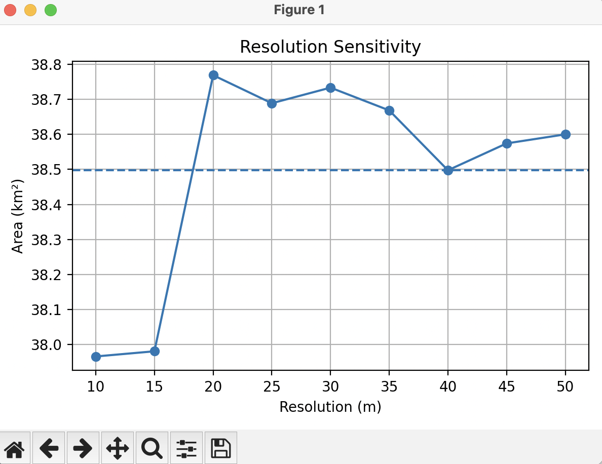

# Dam Area Measurement System

Geospatial measurement pipeline for reservoir perimeter, surface area, and timescale tracking using Sentinel-2 satellite imagery.

## Overview

This project provides an automated pipeline to estimate:
- Reservoir surface area
- Area tracking over time (Timeseries analysis)
- Uncertainty quantification (Resolution & Threshold sensitivity)

The system performs:
- Automatic CRS (UTM) handling and coordinate transformations
- NDWI-based water detection with automated cloud masking
- Connected reservoir selection ensuring we analyze the water body physically attached to the queried dam
- Adaptive bounding box expansion and resolution clamping (adhering to Sentinel-Hub API limits)
- Error margin estimations based on spatial and index resolutions

## Architecture

The project utilizes a robust, modular pipeline:
- `fetch_dam/`: Geocoding dams (OpenStreetMap fallback) and loading known dam structural coordinates.
- `pipeline/`: Core steps for raw data acquisition, NDWI processing, parsing pixel areas, and plotting visualizations.
- `sentinel/`: Handlers for the Sentinel-Hub API requests, caching, and arrays.
- `tiling/` & `geometry/`: Geographic spatial manipulations and segment intersections.
- `processing/` & `uncertainty/`: Water mask processing sequences, algorithms to capture the largest connected geometries, and sensitivity models to provide standard errors on computed areas.

## Installation

### Prerequisites
- Python 3.8 or higher
- A Sentinel Hub account with API access

### Steps

1. Clone the repository:
   ```bash
   git clone https://github.com/rushatdixit/damArea.git
   cd damArea
   ```

2. Install dependencies:
   ```bash
   pip install -r requirements.txt
   ```

3. Set up environment variables:
   Create a `.env` file in the root directory with your Sentinel Hub credentials:
   ```env
   SH_CLIENT_ID=your_client_id
   SH_CLIENT_SECRET=your_client_secret
   SH_INSTANCE_ID=your_instance_id
   ```
   *Obtain these credentials from [Sentinel Hub](https://www.sentinel-hub.com/).*

## Usage

To run the pipeline for a specific dam:

```bash
python main.py "Dam Name"
```

### Example Run

Executing for a major dam like Bhakra Nangal:
```bash
python main.py "Bhakra Nangal"
```

**Terminal Output:**
```text
Running pipeline for: Bhakra Nangal

Found dam in database. Skipping openstreetmap query.
24200.0
Adjusted resolution to : 17
Fetching RGB Data...
RGB received | Shape: (2384, 2372, 3)
Getting NDWI bands...
Computing NDWI...
NDWI range: -1.000 to 1.000
Applying water threshold to NDWI...
Found 1295 water components.
Selected reservoir area: 96.1902 km²
Boundary distance to dam: 54.13 meters
Optimal resolution for reservoir AOI: 15
Fetching RGB Data...
RGB received | Shape: (2449, 1817, 3)
...
[Processing Logs]
...
Computing Area over Time for interval ('2023-01-01', '2023-12-31')...
...
[Timeseries Logs]
...
-----------------------------------
Final Area: 96.2440 ± 2.8614 km²
-----------------------------------

Time elapsed: 148.32 seconds
Pipeline complete.
```

## Visualizations & Outputs

The pipeline automatically compiles its analyses and generates visualization graphics for each dam processed. They are dumped to the `outputs/` folder.

Below are sample generated output sets for the **Bhakra Nangal Reservoir** and the **Mulshi Dam**.

### Bhakra Nangal Reservoir (`outputs/bhakra_nangal/`)

**1. Pipeline Overview**
Visualizes the extraction process from Raw RGB all the way to isolated water-body contour capturing for Bhakra Nangal.


**2. Timeline Analysis**
Tracks how the selected reservoir area naturally changes over the specified timescale (e.g. 1 Year) accounting for seasons, drainage, and environment.



**3. Uncertainty Quantification**
We verify the robustness of our calculation by testing it systematically across scaling NDWI pixel thresholds and varying physical resolutions. This supplies our ± margin of error.

*Threshold Sensitivity:*



*Resolution Sensitivity:*



### Mulshi Dam (`outputs/mulshi/`)

**1. Pipeline Overview**
Visualizes the corresponding extraction and reservoir targeting specifically mapped for Mulshi Dam.


**2. Timeline Analysis**
Tracks how the Mulshi Dam area transitions across the evaluated period.



**3. Uncertainty Quantification**

*Threshold Sensitivity:*



*Resolution Sensitivity:*



## Mathematical Models

To ensure metric rigor and replicability, the system computes properties via the following mathematical boundaries:

### 1. Normalized Difference Water Index (NDWI)
Water bodies are strictly delineated using NDWI, calculated via the Sentinel-2 Green (B03) and Near-Infrared or NIR (B08) optical bands:

$$ NDWI = \frac{\text{Green} - \text{NIR}}{\text{Green} + \text{NIR}} $$

Pixels observing an $NDWI > \text{threshold}$ (typically tuned around 0.2 - 0.3) are computationally flagged as isolated water representations. 

### 2. Physical Area Integration
Given the UTM geographic projection constraints bounding the coordinates, the active pixel layouts are processed as strictly rectangular arrays. A reservoir's overall surface footprint is an arithmetic integration of water pixels normalized to square kilometers:

$$ \text{Area}_{\text{km}^2} = \frac{\sum (\text{Water Pixels}) \times \text{Resolution}_{\text{meters}}^2}{1,000,000} $$

### 3. Cumulative Uncertainty Extraction
To derive the final operational margin of error, the system isolates the sensitivity margin (or variance trajectory) across dynamic NDWI thresholds ($U_t$) and varying spatial API resolutions ($U_r$). The final combined system error bound ($\pm U_{total}$) is rooted via a sum of squares methodology yielding standard geometric variance estimation:

$$ U_{total} = \sqrt{(U_t)^2 + (U_r)^2} $$

## Roadmap

- [ ] Volume estimation via DEM integration
- [ ] Smarter acquisition strategy to deal with continuous overcast weather
- [ ] Adaptive tiling improvements for extremely large reservoir tracking
